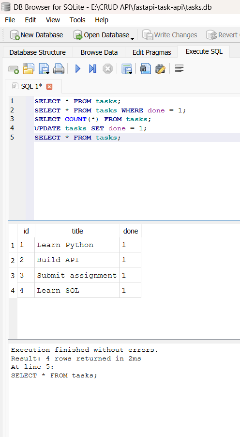

# Task API

A simple RESTful CRUD API built with Python, FastAPI, and SQLite.

## Features

* Create tasks
* View all tasks
* View a single task
* Update tasks
* Delete tasks
* Input validation
* HTTP status codes
* SQLite database storage
* Interactive Swagger documentation

## Database

This project uses **SQLite** because it is lightweight, simple to set up, and does not require a separate database server.

The database file is:

```text
tasks.db
```

It is stored in the root folder of the project.

The database and `tasks` table are automatically created when the application is started if they do not already exist.

Three example tasks are also added automatically on the first run.

## How to Run

Install the dependencies:

```bash
pip install fastapi uvicorn
```

Start the API:

```bash
uvicorn todo:app --reload
```

The API will be available at:

```text
http://127.0.0.1:8000
```

Interactive API documentation is available at:

```text
http://127.0.0.1:8000/docs
```

## Example SQL Query

One SQL query used while exploring the database was:

```sql
SELECT * FROM tasks WHERE done = 1;
```

This query displays all completed tasks stored in the database.

## Database Viewer

The SQLite database was viewed and tested using **DB Browser for SQLite**.

A screenshot of the database viewer is included below:


